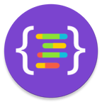

# Changelog Monitor
**Android app to monitor all your favorite libraries release and their changelog in one place.**

Changelog Monitor is available for free on the Google Play Store.

Don't miss out any critical update of a library, subscribe and get notified about the new version within 2hrs of its release. 

Currently the app supports 55 widely used libraries. As a free user you can subscribe and monitor 5 libraries. 

 
### Code Style

 - Formatting - [square/java-code-styles](https://github.com/square/java-code-styles).
 - Run `detektCheck` task before giving PR. (see: [detekt](https://github.com/arturbosch/detekt))

### Project Members
 - Designer - [Ahila Pillai](https://dribbble.com/AhilaPillai)
 - Developer - [Ravikumar N](https://twitter.com/HappyRavi) (**[Available for Hire](https://www.linkedin.com/in/ravikumar89)**)
 
### Acknowledgments
 - [Fernando Cejas](https://twitter.com/fernando_cejas) for his awesome work on [Clean Architecture Kotlin](https://github.com/android10/Android-CleanArchitecture-Kotlin/commits/master).
